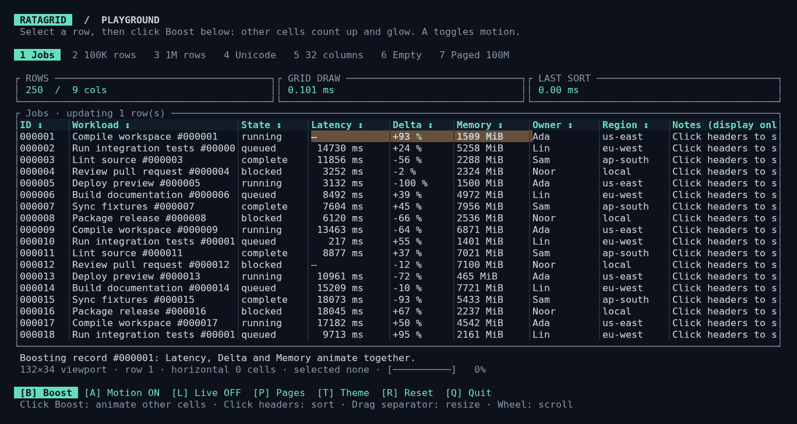

# Ratagrid guide

## Try it

Run these commands in your terminal. Rust installed through [rustup](https://rustup.rs) is required; the checkout pins Rust 1.99.0. The repository is private, so GitHub must authenticate you as an account with access.

For a new checkout:

```sh
git clone https://github.com/kahwee/ratagrid.git ratagrid
cd ratagrid
cargo run --release --locked --example playground
```

If you already have the checkout, run these commands inside it:

```sh
git switch main
git pull --ff-only
cargo run --release --locked --example playground
```

Use a terminal with mouse reporting and colour support. The first release build takes longer; subsequent runs reuse the compiled binary.

To try the visual features:

1. Hover over the **right separator of Workload** until **↔** appears. Hold the left mouse button and drag left: the header and overflowing values end in **…**, while the sort arrow stays visible. Drag right to reveal the full text again. You can also press **Tab twice** to focus Workload, then **-** / **+** to resize it.
2. Press **T** to switch dark/light palettes. Status words, latency thresholds and positive/negative deltas have distinct colours. Click a cell to see the cursor and selected row.
3. Press **B** to boost the selected/first visible row: Latency, Delta and Memory animate and glow. Press **A** to toggle motion.
4. Press **4** for Unicode, **3** for one million resident rows, or **7** for 100 million virtual records with only 50 loaded. In the paged scenario, **[** / **]** changes pages and **P** changes page size.
5. Press **Q** to quit. **L** toggles live updates, **R** resets, and the mouse wheel scrolls; **Shift + wheel** scrolls horizontally.

Start a specific challenge directly (quit each one with Q before running the next):

```sh
cargo run --release --locked --example playground -- --scenario unicode
cargo run --release --locked --example playground -- --scenario million
cargo run --release --locked --example playground -- --scenario paged
cargo run --release --locked --example playground -- --rows 2000000 --columns 128
```

## View screenshots locally

The checkout includes browser-rendered captures of real terminal I/O: `docs/screenshots/polish-dark.png`, `polish-light.png`, and `polish-unicode.png`. Open them with your image viewer; chat previews are not required.

On macOS:

```sh
open docs/screenshots/polish-dark.png
open docs/screenshots/polish-light.png
open docs/screenshots/polish-unicode.png
```

On Linux with a desktop:

```sh
xdg-open docs/screenshots/polish-dark.png
xdg-open docs/screenshots/polish-light.png
xdg-open docs/screenshots/polish-unicode.png
```

On Windows PowerShell:

```powershell
Start-Process .\docs\screenshots\polish-dark.png
Start-Process .\docs\screenshots\polish-light.png
Start-Process .\docs\screenshots\polish-unicode.png
```

Generate your own SVG without opening a terminal:

```sh
cargo run --release --locked --example playground -- --scenario unicode --snapshot ratagrid.svg
cargo run --release --locked --example playground -- --snapshot boost.svg --animation-frame 250
```

Open the resulting SVG in your browser or image viewer.

For measured limits and reproducible benchmarks, see [performance under stress](PERFORMANCE.md). The [playground guide](PLAYGROUND.md) has all controls and capture instructions. For a smaller integration example, run `cargo run --locked --example demo`.

Try the new browsing controls with `cargo run --example explorer`: search, mark ranges, copy formatted text, hide/reorder/pin columns, refresh keyed records, and retry simulated source failures. See [the feature guide](FEATURES.md) for APIs and integration contracts.

## Use it

This is an unpublished development version, available to accounts with access to the private repository. Its API may change before release; pin a reviewed Git commit with Cargo’s `rev` option for reproducible builds. A crates.io release is not yet available.

```toml
[dependencies]
ratagrid = { git = "https://github.com/kahwee/ratagrid" }
ratatui = "0.30"
crossterm = "0.29"
```

```rust
use ratagrid::{Column, Grid};

struct Job { name: String, duration_ms: u64 }

let columns = vec![
    Column::new("Name", 24, |job: &Job| job.name.clone())
        .sortable(|a, b| a.name.cmp(&b.name)),
    Column::new("Duration", 16, |job: &Job| format!("{} ms", job.duration_ms))
        .sortable(|a, b| a.duration_ms.cmp(&b.duration_ms)),
];
let mut grid = Grid::new(columns, vec![
    Job { name: "Compile".into(), duration_ms: 1200 },
    Job { name: "Lint".into(), duration_ms: 90 },
]);

// In your draw callback:
// frame.render_widget(grid.widget(), area);
// In your event loop, when the grid has keyboard focus:
// if let Some(action) = grid.handle_event(&event) { /* respond */ }
```

Enable mouse reporting in your application with Crossterm's `EnableMouseCapture`, and disable it before exiting. The runnable example demonstrates terminal setup and cleanup. The library does not own your event loop or change terminal modes.

Render before forwarding mouse events and redraw after each event: hit-testing uses the last rendered layout. The application owns focus between components and should route keyboard input accordingly. Mouse movement produces hover feedback in terminals that report movement.

## Update cells from another control

Call `grid.update_row(index, |record| { /* change fields */ })` from a button or other event handler, then `grid.flash_cell(index, column, duration)` to highlight a changed cell. Owned data retains its sorting and selection. The application drives fades with `advance_animations(elapsed)`.

The playground's **Boost** button changes Latency, Delta and Memory in the selected row. See [updates and animation](UPDATES.md) for the example and event-loop integration.



## Selection across reloads

Supply an application-owned ID to keep the selected record when refreshed data changes
its position or values. String IDs work too: return an owned string with `.clone()`.

```rust
use ratagrid::{Column, Grid};

let mut grid = Grid::new(
    vec![Column::new("ID", 12, |id: &u64| id.to_string())],
    vec![1, 2, 3],
).with_row_id(|id| *id);
grid.replace_rows(vec![3, 1, 2]);
```

The same builder works on `GridModel` and `Grid::new_paged`. During an external
fetch, selection is hidden; the accepted page restores it if the ID appears exactly
once. Restored selection is revealed vertically when it belongs to the current page.
If absent or duplicated, selection clears and does not return on later reloads.
Actions still use indices into the current `model().rows()`. Edits to a selected
record's ID make its new ID the identity used on the next reload. Row IDs do not
persist selection across application restarts. Replacement still clears cell flashes.

## Large datasets

Use `.with_pagination(page_size)` to page an owned dataset; sorting still processes all resident records. For a database or API, use `Grid::new_paged(columns, total_rows, page_size)`: mark columns with `.sortable_external()`, handle `Action::PageRequested`, and return only that page through `set_page_data`. The source sorts globally. Pass `None` as the total for sources without a count: full responses enable Next, and short or empty responses stop forward navigation. Foreign, stale, and duplicate responses are rejected.

See [pagination and source integration](PAGINATION.md) for examples, controls and database considerations.

## Controls

| Mouse | Behavior |
| --- | --- |
| Click header | Ascending → descending → insertion order |
| Click pager buttons | First / previous / next / last page |
| Click cell | Select the record and place the cell cursor |
| Ctrl + click / Shift + click | Toggle a bulk row mark / extend a range |
| Move over header or row | Hover feedback |
| Wheel | Vertical scroll without changing selection |
| Shift + wheel / horizontal wheel | Horizontal scroll |
| Drag header's right separator | Resize column, minimum four cells |

| Keyboard | Behavior |
| --- | --- |
| Tab / Shift + Tab | Focus headers and reveal the focused column |
| Enter / Space on a header | Cycle sorting |
| Up / Down, k / j | Select rows and reveal the selected row |
| Page Up / Page Down | Move by one viewport |
| Home / End | First / last record in the current page |
| [ / ], Ctrl + Page Up / Page Down | Previous / next page |
| Ctrl + Home / End | First / last page |
| Left / Right, h / l | Move the cell cursor or focused header and reveal its column |
| Shift + Left / Right | Horizontal scroll without moving the cursor |
| + / - on a header | Resize column |
| Enter on a selected row | Emit `RowActivated` |
| / | Enter search; Enter applies, Escape cancels |
| Space on a row | Toggle its bulk-selection mark |
| Shift + Up / Down, Page Up / Down, Home / End | Extend/shrink a range in displayed order |
| Ctrl + A | Mark all filtered rows in the current page |
| Ctrl + C / Ctrl + Shift + C | Request copying the cell / marked rows (or active row) |
| F5 / click Retry | Reload the external page after a source failure |
| Escape | Leave header focus, cancel resize, or clear bulk marks |

## Behavior and scope

- Comparators use actual record values, independently of formatted cells. Numeric `2` sorts before `10`.
- Sorting is stable. Equal values retain insertion order in both directions.
- Selection tracks insertion indices, so sorting preserves the selected record. `Action` row indices always refer to `model().rows()`, not visible positions.
- `update_row` edits a resident record and preserves selection; owned sorting repositions just that row. External edits retain source order and must be persisted by the application.
- `replace_rows` preserves the active sort. Configure `.with_row_id(|record| record.id)` to preserve selection across replacement and external reloads; without it, selection clears. IDs must be stable and unique. Missing or duplicate selected IDs clear selection.
- `GridModel` owns ordering and selection independently of the renderer. `Grid` adds layout, interaction and appearance.
- The selected row's visible position is cached and recomputed when sorting, so rendering and selection lookup do not scan the dataset on every frame.
- Formatting runs only for visible cells. Owned-data sorting processes all records. External pagination delegates sorting and fetching to the application, keeping only one page resident.
- Cells are single-line, plain text. Overflow ends with `…`; grapheme-aware truncation preserves emoji, combining marks and wide characters, while retaining header sort arrows. Terminal control characters are omitted.
- Customize appearance through `style_mut()` and record-based `Column::cell_style(|row| Style::default().fg(...))`. Cell colours compose with hover, selection and animation.
- The active cell uses `style_mut().cursor`. `cursor()` returns the active insertion row index and column; sorting preserves its record, and it is absent while headers have focus or the record is on another page.

The grid supports single-column sorting, keyed cursor/row selection, ranges, filtering, copy actions, and column hiding/reordering/pinning. Multi-column sorting and rich cell renderers remain future work. Cell editing is outside the current scope.

## Development

See the [adversarial review](REVIEW.md) for reproduced defects, completed cleanup and remaining design limits.

```sh
cargo fmt --all --check
cargo clippy --all-targets --locked -- -D warnings
cargo test --all-targets --locked
cargo test --doc --locked
cargo doc --no-deps --locked
```

To reproduce the real-terminal checks on Linux or macOS, install the optional Python dependency and build both interactive examples:

```sh
python3 -m pip install pyte==0.8.2
cargo build --release --examples --locked
python3 scripts/terminal_smoke.py
```

Rust 1.99 or newer is required. GitHub Actions tests Rust 1.99.0 on Linux, macOS and Windows, running formatting, Clippy, all-target tests, doc tests and documentation checks. Linux also runs the real-terminal smoke test.

## License

MIT. Contributions are welcome; see [CONTRIBUTING.md](../CONTRIBUTING.md).
