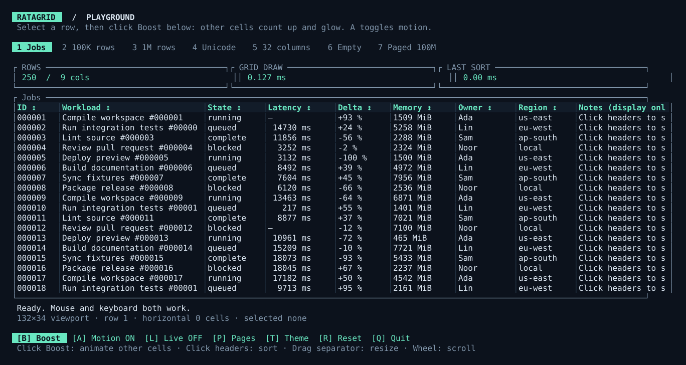
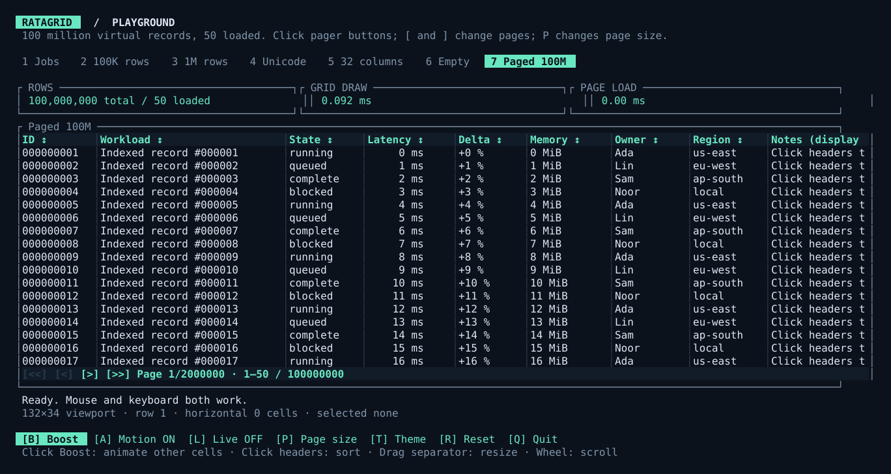
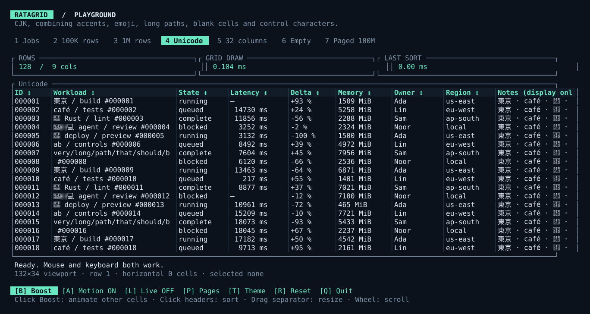
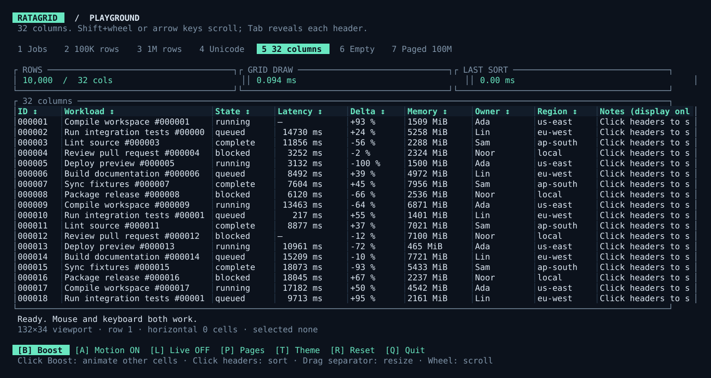
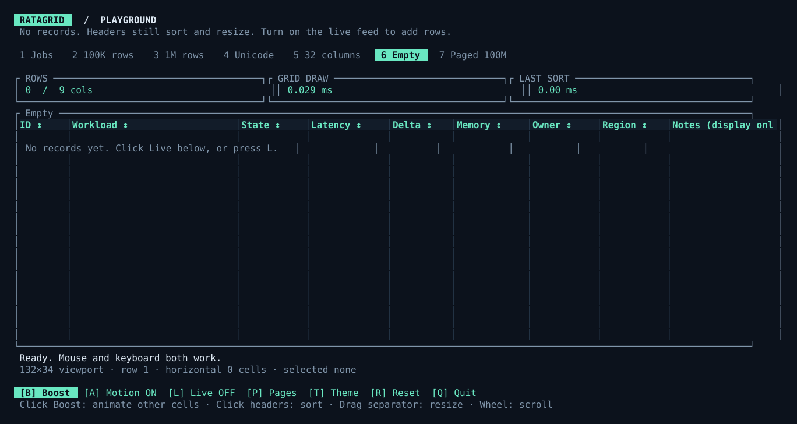
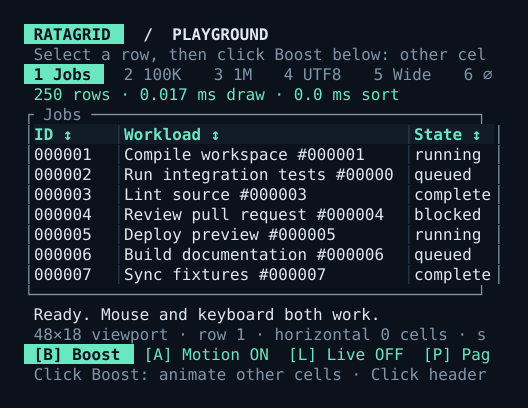
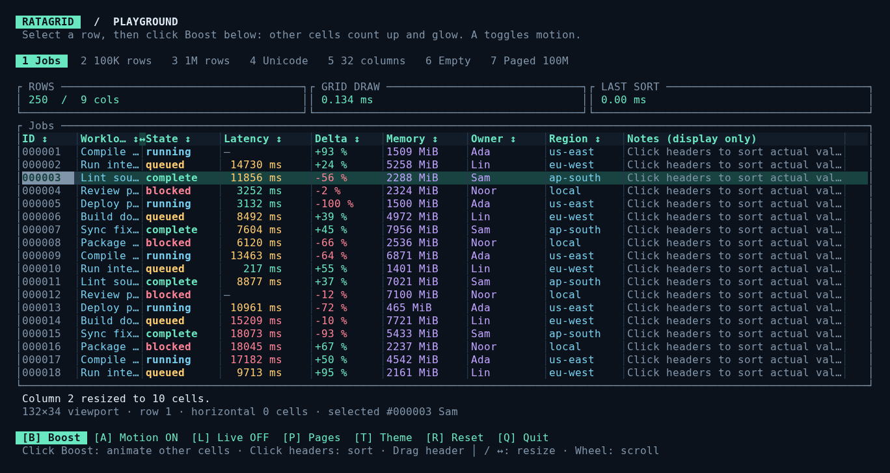
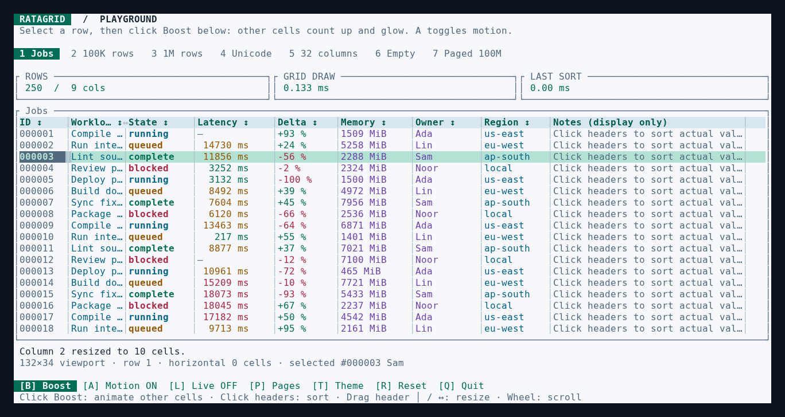
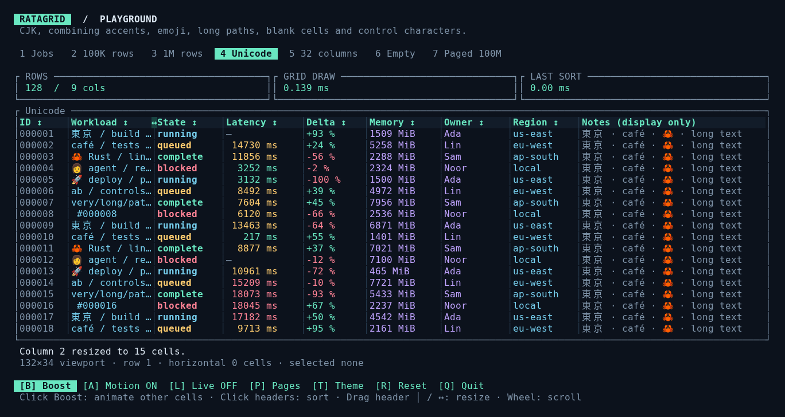

# Ratagrid playground

Run from a checkout with Rust 1.99 or newer:

```sh
cargo run --release --locked --example playground
```

Use `--release` for large datasets. The playground is an actual Ratatui terminal application using the public `Grid` API; the screenshots below are exports of its rendered buffer.

## Scenarios

Click the tabs or press the corresponding number. Small terminals use shorter tab labels and compact metrics.

| Key | Scenario | Records | Columns | Things to try |
| --- | --- | ---: | ---: | --- |
| 1 | Jobs | 250 | 9 | Select a record, sort latency, resize a header |
| 2 | 100K | 100,000 | 9 | End/Home, numeric and workload sorting |
| 3 | 1M | 1,000,000 | 9 | Sort latency, then select a record far down the dataset |
| 4 | Unicode | 128 | 9 | CJK, combining accents, emoji, long paths and control characters |
| 5 | Wide | 10,000 | 32 | Shift+wheel, arrow keys, Shift+Tab to reveal the last column |
| 6 | Empty | 0 | 9 | Sort and resize headers; enable live feed to insert records |
| 7 | Paged | 100,000,000 virtual / 50 loaded | 9 | Click pager buttons, sort globally, press P to change page size |

Click **Boost** or press **B** to animate Latency, Delta and Memory in the selected/first visible row. **A** toggles motion. Changed cells glow and fade; a progress indicator tracks the value tween. See [updates and animation](UPDATES.md).

Click **Pagination** or press **P** to toggle client pagination, or change page size in the Paged scenario. **[** / **]** changes pages; Ctrl+Home/End jumps to the first/last page. See [pagination](PAGINATION.md) for source integration.

Click **Live**, **Theme**, **Reset**, and **Quit** in the footer, or press **L**, **T**, **R**, and **Q**. The live feed replaces records once per second (only the current page in the Paged scenario), retaining sorting and selection by each record’s stable ID. The playground reserves L for the feed; use arrow keys to move the cell cursor and Shift+Left/Right to scroll horizontally. Clicking a cell places the cursor. Hover over a header separator to reveal **↔**. Hold the left mouse button and drag left/right to resize; release to finish. The handle stays visible while dragging, even when the pointer leaves the table. Columns have a four-cell minimum; terminal/layout resizing ends the drag.

Tab focuses headers; Left/Right moves header focus; Enter sorts or opens the selected record; +/- resizes the focused header.

Press **/** to search owned records; Enter applies and Escape cancels. Space marks rows; Shift+arrows or Shift+click selects a range; Ctrl+A marks the current page. Ctrl+C and Ctrl+Shift+C show cell/row copy payloads. In the virtual Paged scenario, search `id:NUMBER` for an indexed exact ID; other queries show a source error. Run `cargo run --locked --example explorer` for full text remote search, column hiding/reordering/pinning, and simulated pending/failing loads. See [the feature guide](FEATURES.md).

## Push it further

```sh
# Two million records, 128 columns. Values are formatted only when visible.
cargo run --release --locked --example playground -- --rows 2000000 --columns 128

# Load only a page from a 100-million-record virtual source.
cargo run --release --locked --example playground -- --scenario paged

# Start in a particular scenario.
cargo run --release --locked --example playground -- --scenario unicode

# Generate an SVG from the actual grid buffer, with no terminal needed.
cargo run --release --locked --example playground -- --snapshot preview.svg
cargo run --release --locked --example playground -- --snapshot boost.svg --animation-frame 250
cargo run --release --locked --example playground -- --width 48 --height 18 --snapshot narrow.svg

# Repeat the rendering/sorting measurements across the six owned-data scenarios (excluding the virtual paged source).
cargo run --release --locked --example playground -- --benchmark

# Stress rendering, sorting, cell updates and virtual paging; writes CSV to stdout.
cargo run --release --locked --example playground -- --stress > stress.csv
# Add 10 million actual resident records (higher memory and CPU use).
cargo run --release --locked --example playground -- --stress-large > stress-large.csv
```

`--rows` accepts 0–2,000,000 and `--columns` accepts 1–128. Snapshot/benchmark dimensions accept widths 1–500 and heights 1–200. These bounds keep accidental resource use manageable in the playground; they are not library limits. The Paged scenario defaults to 100 million virtual records and supports up to nine indexed columns; it never materializes its total dataset. Its timing measures the simulated source, not database or network latency. Run `--help` for the full argument list.

## What the stress run found

The newer [performance report](PERFORMANCE.md) stretches to ten million resident rows, 50 simultaneous sorted updates, a 500×200 viewport and external paging. Its reproducible CSV includes medians and tail timings. The table below records the earlier rendering/sorting run.

Measured on October 4, 2026 in the development Linux container, in release mode, with a 132×34 grid buffer. Each drawing number is the mean of 40 frames. Times depend on the machine and comparator; terminal writes and application chrome are excluded.

| Scenario | Selected draw | Numeric sort | Workload sort |
| --- | ---: | ---: | ---: |
| 250 jobs | 0.141 ms | 0.016 ms | 0.030 ms |
| 100,000 records | 0.144 ms | 8.662 ms | 21.783 ms |
| 1,000,000 records | 0.144 ms | 170.282 ms | 304.749 ms |
| 128 Unicode records | 0.135 ms | 0.007 ms | 0.022 ms |
| 10,000 records / 32 columns | 0.139 ms | 0.583 ms | 1.688 ms |

The first implementation searched for the selected row's position every frame. A million-row selected draw took 0.467 ms versus 0.191 ms without selection. Caching that position removed the dataset scan from each draw; regression tests verify that it follows sorting and replacement correctly.

The first playground comparator formatted workload names on every comparison, taking 2.748 seconds at one million records. Comparing the underlying label and numeric ID removed those allocations; workload sorting now takes about 0.305 seconds. Its suffix order is intentionally numeric.

Owned-data sorting remains synchronous and visits all records: a 170–305 ms sort pauses input briefly on this machine. Expensive user comparators can pause it longer. The live-feed replacement also reallocates the owned dataset and re-sorts if necessary. Targeted `update_row` edits reposition one record without a full sort. Stable row IDs preserve selection across replacement. Batched incremental updates and background sorting are future work. The viewport can scroll a selected row out of view; keyboard navigation reveals it again.

The run also exercised a two-million-record, 128-column snapshot, 1×1 headless layout, 8×4 terminal resize, long text, nullable durations, emoji/CJK clipping, and 500 mixed resize/input operations. The numeric CSV's `visible_cell_upper_bound` is a conservative bound using all configured columns; only intersecting columns are actually formatted.

## See it

### Jobs



### Pagination: 100 million virtual records, 50 loaded



### Unicode



### Wide data



### Empty data



### Narrow terminal, 48×18



Fonts and emoji vary between terminal emulators. SVG export preserves cell positions, colors and text from Ratatui's buffer.

## Repeat the terminal checks

The optional Unix smoke test drives the executable through a pseudo-terminal, rather than calling the event handlers directly. It covers animated cell edits from a footer click, reduced motion, scenario-tab mouse clicks, million-row sorting and selection, drag resizing, wheel scrolling, wide-column focus, live insertion into an empty dataset, mouse/keyboard paging through 100 million virtual records, global page sorting, page-size changes, client paging, theme switching, and resizing the terminal down to 8×4. It also checks mouse capture is disabled when exiting.

```sh
python3 -m venv .venv
.venv/bin/python -m pip install pyte==0.8.2
cargo build --release --examples --locked
.venv/bin/python scripts/terminal_smoke.py
```

It saves real terminal captures to `target/playground/terminal-million.html`, `target/playground/terminal-pagination.html`, `target/playground/terminal-animation.html`, and `target/playground/terminal-resize.html`. Open these files in a browser for the recorded screens. Library regression tests run with `cargo test --all-targets --locked`.

## Source layout

`examples/playground.rs` contains terminal setup and the event loop. The modules in `examples/playground/` separate concerns:

- `app.rs`: controls, live updates and animation state.
- `view.rs`: dashboard layout and rendering.
- `data.rs`: scenarios, record generation and the indexed page source.
- `options.rs`: argument parsing.
- `export.rs`: SVG snapshots.
- `benchmark.rs` and `stress.rs`: performance measurements.
- `tests.rs`: playground regressions.

## Ellipses and colours

Shrinking a column replaces the overflowing text with `…`. Headers keep their sort arrows; expanding the column reveals the original text again. Truncation preserves complete emoji, combining marks and CJK characters. Horizontal viewport cropping keeps its existing scroll behavior.

The playground colours statuses (running cyan, queued amber, complete green, blocked red), latency thresholds (below 5,000 ms green, below 15,000 ms amber, otherwise red), and positive/negative deltas. Workloads and regions use cyan; memory and owners use purple. **T** switches palettes without traversing the dataset. Status words and numeric values remain visible alongside their colours.







These PNGs are browser-rendered captures of real pseudo-terminal input/output, not native terminal-window screenshots. Reproduce them from terminal input:

```sh
cargo build --release --example playground
python3 scripts/capture_polish.py --png
```

The script requires `pyte`; `--png` additionally requires Playwright and Chromium at `/usr/bin/chromium`. HTML captures are available without Playwright.

## Optional cell details

Run `cargo run --release --locked --example playground -- --cell-details`. Hover a truncated data cell for 500 ms or select it and press Enter to open its full value. Escape closes it while preserving selection. Up/Down, PageUp/PageDown and Home/End scroll a keyboard-opened panel; the mouse wheel over a panel also scrolls it. The option survives scenario switches/resets and works with motion disabled. See [library configuration](GUIDE.md#optional-cell-details).
